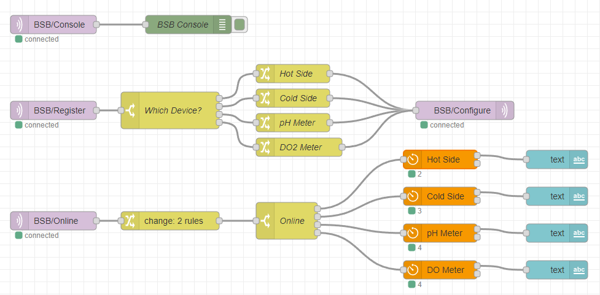

# Blue Screen Brewery
A sophisticated system for brewery automation built around [Node-Red](https://nodered.org/) and [MQTT](https://mqtt.org/). Node-Red is a widely adopted low-code programming environment used in production automation systems and well suited for brewery automation. MQTT is an IoT (Internet of Things) communication protocol built on TCP. Blue Screen Brewery (BSB) leverages both these technologies to integrate sensors and devices found in the brewery along with external software services in a single integrated user interface. BSB is inspired by other brewery automation systems such as [BruControl](https://brucontrol.com/) and [CraftBeerPi](http://web.craftbeerpi.com/) but aims for maximum flexibility and extensibility in a low-code environment. BSB is entirely open source under the Apache 2 license. Some examples of elements that are possible to integrate with the 'out-of-the-box' firmware are;  

* DC Pumps (more generally, PWM devices)
* SSR controlled AC heating elements
* Digital flow meters
* DC heating elements
* Tilt sensors
* Onewire temperature sensors
* Atlas Scientific EZO sensors (pH and DO2)
* BrewFather via 3rd party contributor to Node-Red

## Development Status
Still in the early stages of development. Supported devices, interfaces and various other aspects of the code are open to change as new requirements are discovered, feedback from other users is considered, etc. That said, I already run this in my own brewery which is generally 'always on'. Key components levergaged, such as Node-Red and Mosquitto, are already stable. The firmmware was a ground up effort and almost certainly contains bugs, but seems stable enough for home brewery use (i.e. has been tested with lengthy up-time over weeks).   

## Architecture
The center of the system is the Node-Red instance running on any supported platform; Windows, MacOS, Rasp-Pi, Azure cloud, etc. The MQTT broker is generally, but not necessarily, installed on the same machine. For convinience, a pre-configured Rasp-Pi image is available for download (TODO) which provides a working Node-Red and MQTT installtion. Node-Red communicates with any number of Arduino boards (ESP32) via MQTT to controll attached devices, read from sensors, etc. The firmware is common between all Arduino devices and configured dynamically via messages from Node-Red. More on this in the details below.


## User Interface
A browser based UI is generated via use of Node-Red Deshboard nodes within the flow. Create a layout and UI elements specific to your brewery needs. An example of a three vessel 'hot side' configuration is shown below.


# Installation
Installtion involves the following steps presented in detail below. In addition to the machine running Node-Red and MQTT, any number of Arduino ESP32 boards are needed to run the BSB firmware and integrate the actual hardware devices in the brewery; e.g. pumps, SSRs, etc. This document does not cover building a hardware control panel; just the software/firmware side is considerded.

* Install Node-Red and an MQTT broker on a supported machine. We'll cover Raspberry Pi below but it could be Windows, Mac or even in the cloud.
* Configure MQTT to use SSL/TLS. Technically optional, but secures communication between Node-Red and your Arduino controllers.
* Build the BSB firmware and burn to all desired Arduino boards.
* Configure Arduino controllers (i.e. assign functions to pins) via JSON in Node-Red.
* Build Node-Red flows to run your brewery and make beer!

## Raspberry Pi System with Node-Red and Mosquitto (MQTT)

* Follow the instuctions for installing [Ubuntu-Server](https://ubuntu.com/tutorials/how-to-install-ubuntu-on-your-raspberry-pi#1-overview) using the RaspPi Imager.
* Next, perform the steps here for installing [Node-Red](https://nodered.org/docs/getting-started/raspberrypi)
* Run ```sudo apt install mosquitto mosquitto-clients``` to install the Mosquitto MQTT broker.

## Configure and Secure Mosquitto (optional)
Many tutorials on running Mosquitto on a local network use username/password authentication 'in the open'. While this may be low'ish risk for a private network, most would prefer not to have authentication params flying around wirelessly in plain text. The steps below configure MQTT to use certificate authentication and TLS encryption. If this is configured, then you must also copy the certs into the firmware configuration file when building (more on this later). Node-Red also needs to have the cert files but this is relaively trivial to configure. 

* On the Node-Red/MQTT machine, download this script [generate-CA.sh](https://github.com/owntracks/tools/tree/master/TLS).
* generate-CA.sh without any arguments will generate the server certificates. Place them in /etc/mosquitto/certs.
* Run ```chmown -R mosquitto /etc/mosquitto/certs``` to ensure Mosquito can read the files.
* Edit /etc/mosquitto/conf.d/default.conf to point at the cert files and enable required certificates. An example is provided in this repo under Mosquitto.
* Restart Mosquitto using ```sudo service mosquitto restart```
* Generate the client certs by running ```generate-CA.sh client [name]```. Name can be anything but it must not be empty.
* ca.crt, ```[name].key``` and ```[name].crt``` are needed for both Node-Red's MQTT configuration and the BSB firmware. More on this later. 

## Building the BSB Firmware
The firmware has only been tested on an ESP32 board and the 'helper' script referenced below assumes such a device.

* Download arduino-cli from https://arduino.github.io/arduino-cli/0.20/installation/
* On the command line, navigate to Firmware_ESP32 and copy arduino-cli here
* Edit Firmware_ESP32/Config.h to configure your device's name, WiFi parameters and SSL/TLS certs if applicable.
* Run `arduino-cli board list` with the board plugged in and unplugged to determine the port.
* On Windows, edit build.bat to set the port and then run built.bat from within Firmware_ESP32
* For other operating systems, use build.bat as a reference for what commands to run.  

## Firmware Configuration
When the BSB firmware boots, it sends the MQTT message 'BSB/Register'. Node-Red listens for this event and responds with 'BSB/Configure' which contains JSON describing the
device types and mappings between MQTT messages and Arduino pin state. For example, suppose Config.h is edited so the DEVICE_NAME is 'Cold Side'. When this device boots, it
will send the 'BSB/Register' message with the payload 'Cold Side'. Node-Red receives this message and chooses the JSON to send based on the device name payload. Node-Red sends 
the 'BSB/Configure' message with the following JSON payload, which defines two Onewire sensors, two DC heating pads, two DC pumps and two Tilt sensors. The Topic field defines
the MQTT message name to bind the device. The meaning of Index depends on the device type, both of which are documented below. It's important the label, in this case
'Cold Side', matches the DEVICE_NAME in Config.h or the configuration will be ignored. This facilitates many devices running in parallel without stepping on each other. 

```javascript
{
    "Cold Side": [
        {
            "Topic": "BSB/Unitank-1-Temp",
            "Index": 1,
            "Type": "Onewire"
        },
        {
            "Topic": "BSB/Unitank-2-Temp",
            "Index": 0,
            "Type": "Onewire"
        },
        {
            "Topic": "BSB/Unitank-1-Heat",
            "GPIO": 27,
            "Type": "Digital-Out"
        },
        {
            "Topic": "BSB/Unitank-2-Heat",
            "GPIO": 15,
            "Type": "Digital-Out"
        },
        {
            "Topic": "BSB/Unitank-1-Cool",
            "GPIO": 25,
            "Type": "Digital-Out"
        },
        {
            "Topic": "BSB/Unitank-2-Cool",
            "GPIO": 14,
            "Type": "Digital-Out"
        },
        {
            "Topic": "BSB/Blue-Tilt",
            "Index": 5,
            "Type": "Tilt"
        },
        {
            "Topic": "BSB/Purple-Tilt",
            "Index": 3,
            "Type": "Tilt"
        }
    ]
}
```

The image below is an example in Node-Red of supporting four Ardunino devices all with a different configuration. The incoming Register message on the left flows to a Switch node
that routes the message based on the DEVICE_NAME in the payload to the matching Change node. The Change node sets the msg.payload to the approprate JSON and broadcasts it via the
Configure message. The target device reads the configuration and begins listening/publishing as instructed.



## Device Types
These are the valid devices to be used in the configuration 'Type' field(s). Note, the 'Topic' field is always required and denotes the MQTT messsage that will be subscribed to or published on depending on the type. For example, type Digital-In will publish to the Topic while type Digital-Out will subscribe to the Topic. 

* **Digital-In**  - Reads a binary value, 0 or 1, from the pin given in the GPIO field. The message is broadcast whenever the value changes.
    - Topic - Required. Payload will be set to 0 or 1 reflecting pin state.
    - GPIO  - Required. An integer representing the assigned GPIO pin.


* **Digital-Out** - Writes a binary value, 0 or 1, to the pin given in the GPIO field. Used to control on/off devices such as some types of pumps and heaters. Node-Red flows can modulate this state over time to implement a 'Duty Cycle' to control devices such as AC heaters attached to solid state relays.
    - Topic - Required. Set payload to 0 or 1.
    - GPIO  - Required.


* **PWM**         - Pulse width modulation. A digital signal pulsed at a high frequency. Can be used to vary power directly to low voltage devices; e.g . dim an LED, or vary a higher voltage analog signal with some additional hardware. A common application is to vary the flow rate of DC pumps. Advanced users can change the frequency and resolution in Config.h as desired.
    - Topic - Required. Set payload to an integrer in the range [0, 255] unless custom resolution is configured.
    - GPIO  - Required.


* **Analog-In**   - Performs an analog value read from the associated GPIO pin. The message is broadcast whenever the value changes.
    - Topic - Required. Set payload to an integer value.
    - GPIO  - Required.


* **Counter**     - Publishes 'pulses per second' from the associated GPIO pin. A common application is integration of digital flow meters.
    - Topic - Required. Payload is set to the integer number of pulses received in the last second.
    - GPIO  - Required.   


* **Onewire**     - DS18B20 (Dallas Semiconductor) temperature sensor. The message is broadcast upon a value change.
    - Topic - Required. Payload is set to the floating point value returned by the sensor in F units.
    - GPIO  - Required.
    - Index - Required. Dnotes the index of the sensor on the Onewire bus in the range of number of sensors on the bus; e.g For three sensors valid values are 0, 1 and 2.


* **Atlas**       - Integrates an Atlas Scientific sensor via their EZO embedded board such as pH and dissolved O2 meters.
   - Topic   - Required. Payload is set to raw data from the sensor. This can be either a status string (e.g. *OK) or a reading such as 4.25. 
   - Rx      - Required. The integer software serial GPIO pin used for rx (receive).
   - Tx      - Required. The integer software serial GPIO pin used for tx (send).
   - Command - Optional. The MQTT message the sensor will listen on for incoming commands. This can be used to issue calibration or temperature compensation commands from Node-Red flows. 


* **Tilt**        - Integrates temperature and Sp.Gr. readings from a Tilt sensor.
    - Topic - Required. Payload is set to JSON containing the reading data in the format {"Temp": x, "Grav": y}.
    - GPIO  - Required.
    - Index - Required. Index in this context maps to the Tilt sensor color. The mappings are given below. For example, to integrate a Blue Tilt set Index to 5.   

| Index                                     | Color                                      |
| ------------------------------------------| ------------------------------------------:|
| 0                                         | Red                                        |
| 1                                         | Greed                                      |
| 2                                         | Black                                      |
| 3                                         | Purple                                     |
| 4                                         | Orange                                     |
| 5                                         | Blue                                       |
| 6                                         | Yellow                                     |
| 7                                         | Pink                                       |